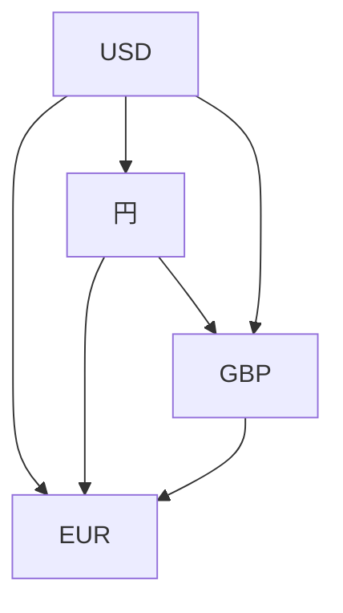

# MarkDown について

[MarkDown] 記法を使ってドキュメントを記述していきます。

[MarkDown]: https://www.markdown.jp/what-is-markdown/

## MarkDown 記法

### 見出し

\#の後ろに文字を書くと、その行は見出しとして表示されます。\#の数によって見出しのレベルを表すことが出来ます

```
# 見出しレベル1
## 見出しレベル2
### 見出しレベル3
```

### 段落

段落は空行を入れることで表現します。

### 箇条書き(リスト)

行頭に「-」を\*記入します。ネストするときはタブを入れて「-」を使います。

### 引用

### リンク

リンクとは文章の中の単語の説明を入れたいときに使います。リンクしたいテキストを
半角 [] で囲み、それに続く半角 () にリンク先URLを書きます。

### 強調

- 文字を斜体にする方法

斜体にしたい文字の先頭と後尾に、半角のアスタリスク(\*)または、半角のアンダースコア(\_)を入力します。

\*斜体\*にしたい文字

*斜体*にしたい文字

- 文字を太字にする方法

太字にしたい文字の先頭と後尾に、半角のアスタリスク２つ(\*\*)または、半角のアンダースコア２つ(\_\_)を入力します。

\*\*太字\*\*にしたい文字

**太字**にしたい文字

- 訂正線を引く方法

訂正線を引く文字の先頭と後尾に、半角のチルダ２つ(\~\~)を入力します。

\~\~訂正線\~\~を引く文字

~~訂正線~~を引く文字

- 下線を引く方法

下線を引く文字の先頭に\<u\>、後尾に\</u\>を入力します。

\<u\>下線\</u\>を引く文字

<u>下線</u>を引く文字

**下線**を引く文字

### 表(Table)

入力例

```markdown
| TH  | TH  |
| --- | --- |
| TD  | TD  |
| TD  | TD  |
```

- 右詰めする場合

-------:

- センタリングする場合

:-------:

- 左詰めする場合

:--------

## 図形を描画するmermaid記法

### 記法フローチャート(Basic flowchart)




## neovimをMarkDown用に設定する

## MarkdownPreview

## markdown-toc
