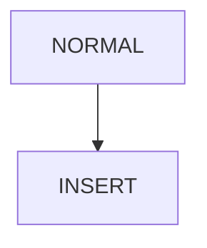

# 1. チュートリアル

## 1.1. 編集の基本

### 1.1.1. 準備

### 1.1.2. モード

neovimには通常(NORMAL)モード、挿入(INSERT)モード、ビジュアル(VISUAL)モードがあります。

| モード           | 左下の表示 | 入り方                                        | 抜け方    | 略語 |
| ---------------- | ---------- | --------------------------------------------- | --------- | ---- |
| 通常モード       | NORMAL     | 初期状態,他モードから抜けたとき               | i,v,:     |      |
| 挿入モード       | INSERT     | i                                             | \<Esc>    | i    |
| ビジュアルモード | VISUAL     | v                                             | \<Esc>    | v    |
| コマンドモード   | COMMAND    | :                                             | \<Esc>    | x    |
| ターミナルモード | TERMINAL   | \<Ctrl-/>,Lazynvimでは\<leader>ft,\<leader>fT | \<Ctrl-d> | t    |
| サーチモード     | 絵文字     |                                               |           | s    |
| 不明なモード     | TODO       | TODO                                          | TODO      | o    |

<!-- TODO: sとoのモードについて調べる -->

---

## title: モードの遷移

    <!-- A@{ shape: circle, label:"Start" } --> B[NORMAL] --> C[INSERT] -->

## 1.2. カーソルの移動

通常モードにおけるカーソルの移動方法についてまとめます。

| キーバインド  | 説明                               | 数値との組み合わせ | 説明         |
| ------------- | ---------------------------------- | ------------------ | ------------ |
| j, \<Down>    | 下に移動                           | 3j                 | ３行下に移動 |
| k \<Up>       | 上に移動                           | 3k                 | ３行上に移動 |
| h             | 左に移動                           | 3h                 | ３桁左に移動 |
| l             | 右に移動                           | 3l                 | ３桁右に移動 |
| M             | スクリーンの真ん中に移動           |                    |              |
| w             | 次の単語の先頭に移動               |                    |              |
| b             | 前の単語の先頭に移動               |                    |              |
| ^, 0, \<HOME> | 行の最初の文字,行頭                |                    |              |
| $, \<END>     | 行の最後の文字,行末                |                    |              |
| Ctrl-f        | 1ページ分をスクロールダウン        |                    |              |
| Ctrl-d        | スクリーンの半分をスクロールダウン |                    |              |
| Ctrl-b        | 1ページ分をスクロールアップ        |                    |              |
| Ctrl-u        | スクリーンの半分をスクロールアップ |                    |              |

## 1.3. 挿入モードへの入り方

一番簡単なやり方は文字を挿入したい箇所にカーソルを移動してiをタイプします。

ノーマルモードから挿入モードに入る方法

| キーバインド | 説明                   |
| ------------ | ---------------------- |
| i            | カーソルの前に挿入     |
| I            | カーソルの行頭に挿入   |
| a            | カーソルの後ろに挿入   |
| A            | カーソルの行末に挿入   |
| o            | カーソルの下の行に挿入 |
| O            | カーソルの上の行に挿入 |

### 1.3.1. neovimの終了

### 1.3.2. 基本操作

## 1.4. 高度な編集

## 1.5. 検索

## 1.6. 大きなサイズのテキストの編集および複数ファイルの編集

## 1.7. 複数のウィンドウの扱い

## 1.8. 基本的なビジュアルモード

## 1.9. プログラマ向けコマンド

## 1.10. 基本的な略語、キーボード割り当て、初期設定ファイル

## 1.11. 基本的なコマンドモードの操作

## 1.12. BUIの基本的な使い方

## 1.13. テキストファイルの扱い方

## 1.14. 自動完了

## 1.15. オートコマンド

## 1.16. ファイル回復とコマンドライン引数

## 1.17. その他のコマンド

## 1.18. 操作方法

## 1.19. 本書で分類されていないトピックス

# 2. 詳細

## 2.1. 基本的な編集作業（完結編）

## 2.2. 正規表現を使った高度な検索

## 2.3. さまざまなテキストブロックと複数ファイル

## 2.4. ウィンドウとセッション

## 2.5. ビジュアルモード：上級編

## 2.6. プログラミングに便利な機能

## 2.7. 短縮形とキーボードマッピングに関する全て

## 2.8. コマンドモード（:）のコマンド全集

## 2.9. GUIコマンド：上級編

## 2.10. 式と関数

## 2.11. エディタのカスタマイズ

## 2.12. プログラミング言語別シンタックスオプション

## 2.13. シンタックスファイルの記述方法

# 3. 付録1 リファレンス

# 4. 付録2 ライセンス

# 5. 付録3 インストール
