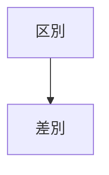

タイトル: あなたは差別社会に生きている

サブタイトル: あなたに気づかないように巧妙に区別する社会

作者: 五十嵐浩人

タグ: 差別, 区別

url: https://

<!-- mtoc-start -->

- [1. はじめに](#1-はじめに)
  - [1.1. 区別は差別の準備段階である](#11-区別は差別の準備段階である)
- [2. 区別](#2-区別)
  - [2.1. あなたの身近にある区別](#21-あなたの身近にある区別)
    - [2.1.1. 昔は「人のふり見て我がふり直せ」という社会でした](#211-昔は人のふり見て我がふり直せという社会でした)
    - [2.1.2. あなたのために言っている](#212-あなたのために言っている)
    - [2.1.3. しつけだから](#213-しつけだから)
- [3. 差別](#3-差別)

<!-- mtoc-end -->

# 1. はじめに

日本では2025年の現在、参政党による差別発言、差別行動が話題になり批判の対象となっています。

差別発言から始まる差別行動は今に始まったことではありません。いつから始まったのかはわかりませんが、少なくとも民族差別で政権を奪い差別政策を行ったナチス・ドイツの時代にはありました。

私が知る限りこのような差別社会になることを予見してくれた書物に「新約聖書」と「日本国憲法」があります。

「新約聖書」のガラテヤ人への手紙3章28節には「キリスト・イエスにあって、あなたがたはみな、神の子だからです。あなたがたのうちキリストにつくバプテスマを受けた者は、みんなキリストを着ているからです。そこでは、ユダヤ人もギリシャ人もなく、奴隷も自由人もなく、男も女もありません。あなたがたはみな、キリスト・イエスにあって一つなのです。」とあります。

また「日本国憲法」の第十四条には「国民は、法の下に平等であつて、人種、信条、性別、社会的身分又は門地により、政治的、経済的又は社会的関係において、差別されない。」とあります。

このような書物があっても差別がなくならないのは何故だろうと考えこの文章を残します。

## 1.1. 区別は差別の準備段階である

よく耳にする「これは差別ではない区別だ」という言葉があります。厳密には差別と区別は違うでしょう。しかし本質的には同じです。人は差別するために区別するのです。

# 2. 区別

## 2.1. あなたの身近にある区別

あなたの身近にはどんな区別があるのでしょうか。いくつかの場面での区別について考えてみましょう。

- 学校での区別
- 社会人になってからの区別
- 世間体としての区別

### 2.1.1. 昔は「人のふり見て我がふり直せ」という社会でした

### 2.1.2. あなたのために言っている

人が人にとやかく言うときに「僕はあなたのことを考えて言うんだよ」と言うのがあります。そういうことを言う人に対しては「どの立場で言ってるですか」、「余計なお世話ですね」、「じゃ、金くれよ」と言うのが正しい対応だと思います。

### 2.1.3. しつけだから

# 3. 差別

「差別発言」という言葉の定義をしなくてはいけません。

以下に、この投稿でよく使う言葉の定義をしておきます。

他人：自分以外の人を他人として扱います。家族、恋人、友達、学校の先生、会社の上司、同僚であろうと他人です。何故なら、身近の人だと思っていても彼らは、いつ自分を裏切るかわからないからです。

差別発言：自分と属性の違う他人をその属性で区別し「こういう属性の人はこうなんだ」と発言することを差別発言として扱います。例えば関東の人が「関西の人はこうなんだよね〜」と言うのを差別発言として扱います。日本人が「外国人が〜」と言うのはその内容、例えば犯罪を犯す、金銭的に優遇されていると主張している時点で差別発言です。人の属性の違いで発言する人はただの調子に乗った奴と認識するのは大事です。

この投稿では、差別発言の上位の概念であり、日常でよく耳にする「他人にとやかく言う」という人達について考えてみたいと思います。
oが他人にとやかく言うときに「しつけだから」というのがあります。
